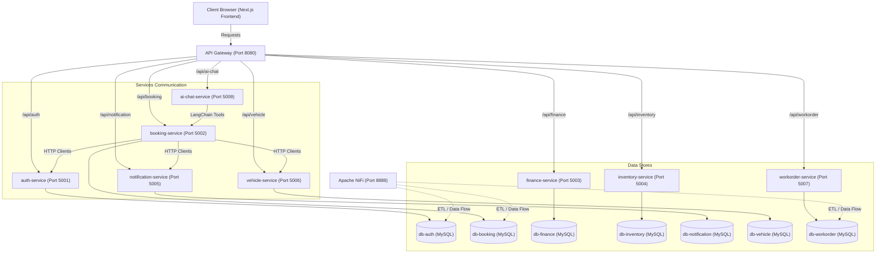

# EV Service Center Management - Project Analysis Report

This report provides a detailed analysis of the **EV Service Center Management** project codebase. It covers the system's architecture, frontend/backend directory layouts, database schemas, coding patterns, naming conventions, API design, core libraries, and security configurations.

---

## 1. Project Architecture

The project is structured as a **Microservices Architecture** simulating an Electric Vehicle (EV) Service Center Management system. The entire setup runs in a containerized environment managed by Docker Compose.



### Architectural Components
- **API Gateway**: An Express app using `http-proxy-middleware` configured to route client requests (port `8080`) to the respective backend microservices.
- **Frontend**: A Next.js 15 client dashboard (port `3000`) consuming APIs exposed by the Gateway.
- **Backend microservices**:
  - `auth-service` (port `5001`): Handles registration, login, JWT issuance, and user database profiles.
  - `booking-service` (port `5002`): Manages service center branches and customer appointment bookings.
  - `finance-service` (port `5003`): Oversees invoice generations and payment records.
  - `inventory-service` (port `5004`): Tracks spare parts in stock, records stock logs (IN/OUT), and logs parts usage.
  - `notification-service` (port `5005`): Dispatches notifications for service updates, booking updates, and staff alerts.
  - `vehicle-service` (port `5006`): Records vehicles under client ownership and triggers maintenance reminders.
  - `workorder-service` (port `5007`): Tracks service checkup lists, staff assignments, and workorder statuses.
  - `ai-chat-service` (port `5009`): A Python service exposing conversational endpoints powered by Google's Gemini models and LangChain.
- **ETL Integration**: Apache NiFi (port `8888`) container configured with persistent volumes for data integration workflows.
- **Database**: A single MySQL 8 container hosting separate logical databases for each service, enforcing domain isolation.

---

## 2. Backend Structure

Node.js services are written in JavaScript utilizing ES6 Modules (`"type": "module"` in `package.json`). They follow a consistent MVC-like layout:

```text
ev-service-center-backend/<service-name>/
├── Dockerfile
├── .dockerignore
├── .env
├── package.json
├── index.js               # Entry script loading env variables and starting server
└── src/
    ├── app.js             # Standard Express setup with cors, body-parser, and routing imports
    ├── config/
    │   └── db.js          # Database connection using Sequelize
    ├── controllers/
    │   └── <name>Controller.js   # Request execution, response routing, and ORM operations
    ├── models/
    │   └── <name>.js      # Sequelize model attributes, types, and DB relationship rules
    ├── routes/
    │   └── <name>Routes.js # Express router endpoints mapping to controller methods
    ├── middlewares/
    │   └── authMiddlewares.js # JWT & Role-based authentication filters
    └── client/            # (Optional) Axios wrapper clients making HTTP calls to external microservices
```

### Python AI Chat Service Layout
The `ai-chat-service` differs, using FastAPI and LangChain:
- `app.py`: FastAPI server setting up LangChain's `GoogleGenerativeAIEmbeddings` and `ChatGoogleGenerativeAI` models (Gemini 2.5 Flash), FAISS vector store loading, custom tool configurations, and conversational chat endpoints.
- `ingest_data.py`: A utility script reading `knowledge_base.txt` to parse service manual instructions, convert them into vector embeddings, and save the local index (`faiss_index`).
- `requirements.txt`: Standard Python package lists (FastAPI, uvicorn, langchain, faiss-cpu, pydantic, etc.).

---

## 3. Frontend Structure

The frontend app (`ev-service-center-frontend`) is a modern React application utilizing **Next.js 15 (App Router)** and **TypeScript**:

```text
ev-service-center-frontend/
├── public/                 # Static asset folders
└── src/
    ├── app/                # Page routing based on folders structure
    │   ├── (admin)/        # Dashboard panel utilizing Sidebar layout
    │   │   ├── layout.tsx
    │   │   ├── page.tsx    # Dashboard main metrics page
    │   │   └── (others-pages)/
    │   │       ├── appointment/ # Booking list & manager
    │   │       ├── booking/     # New booking creation
    │   │       ├── chat/        # Firebase Customer Chat window
    │   │       ├── part/        # Spare parts inventory logs
    │   │       ├── profile/     # User details settings
    │   │       ├── service-center/ # Service branches view
    │   │       ├── task/        # Workorders & Kanban workflow
    │   │       ├── user/        # Admin User Management
    │   │       └── vehicle/     # Owner vehicles panels
    │   └── (full-width-pages)/ # Fullscreen pages
    │       ├── (auth)/      # Login / Registration layout and pages
    │       └── (error-pages)/ # Error fallback screens
    ├── components/         # Modular React components grouped by pages/features
    │   ├── appointment/
    │   ├── auth/
    │   ├── chat/           # Firebase chat box and AI chatbot widget UI
    │   ├── common/         # DataTables, Breadcrumbs, Paginations, SearchBoxes, Theme togglers
    │   └── ui/             # Reusable UI elements (Badges, Buttons, Cards, Inputs)
    ├── constants/          # Static data sets
    ├── context/            # Theme and Sidebar React contexts
    ├── hooks/              # Custom hooks wrapping states (useAuth, useUsers, usePagination)
    ├── lib/
    │   └── httpClient.ts   # Custom Axios instance configuring requests/response interceptors
    ├── services/           # Service interfaces consuming endpoints (authService, userService)
    ├── types/
    │   └── common.ts       # Shared TypeScript type definitions
    └── utils/              # Text formatting and helper functions
```

---

## 4. Database Structure

The project implements a **Database-per-Service** design to decouple individual domain models. Relational foreign key constraints across microservices are resolved at the application service layer via HTTP calls instead of DB-level constraints.

### Logical Tables Map

#### 1. Database: `db-auth`
*   `Users`: Stores account details and application roles.
    *   `id` (INT, PK, Auto Increment)
    *   `username` (VARCHAR, Unique)
    *   `email` (VARCHAR, Unique)
    *   `password` (VARCHAR, hashed with bcrypt)
    *   `role` (VARCHAR, default 'user')
*   `RefreshTokens`: Controls session lifecycle and token rotations.
    *   `id` (INT, PK)
    *   `token` (VARCHAR)
    *   `expiryDate` (DATETIME)
    *   `userId` (INT, FK -> `Users.id`)

#### 2. Database: `db-booking`
*   `ServiceCenters`: Information on repair shop locations.
    *   `id` (INT, PK)
    *   `name` (VARCHAR)
    *   `address` (VARCHAR)
    *   `phone` (VARCHAR)
    *   `email` (VARCHAR)
    *   `managerId` (INT, logical reference to User)
*   `Appointments`: Client schedule bookings.
    *   `id` (INT, PK)
    *   `userId` (INT, logical reference to User)
    *   `serviceCenterId` (INT, FK -> `ServiceCenters.id`)
    *   `vehicleId` (INT, logical reference to Vehicle)
    *   `date` (DATETIME)
    *   `timeSlot` (VARCHAR)
    *   `status` (VARCHAR, 'pending', 'confirmed', 'cancelled', 'completed')
    *   `notes` (VARCHAR)
    *   `createdById` (INT)

#### 3. Database: `db-finance`
*   `Invoices`: Generated service bills.
    *   `id` (INT, PK)
    *   `customerId` (INT, logical reference to User)
    *   `appointmentId` (INT, logical reference to Appointment)
    *   `amount` (FLOAT)
    *   `description` (TEXT)
    *   `status` (ENUM: 'pending', 'paid', 'overdue', 'cancelled')
    *   `dueDate` (DATETIME)
*   `Payments`: Financial transaction records.
    *   `id` (INT, PK)
    *   `invoiceId` (INT, FK -> `Invoices.id`)
    *   `amount` (DECIMAL)
    *   `paymentMethod` (ENUM: 'cash', 'bank_transfer')
    *   `transactionId` (VARCHAR)
    *   `status` (ENUM: 'pending', 'success', 'failed', 'refunded')
    *   `paidAt` (DATETIME)

#### 4. Database: `db-inventory`
*   `Parts`: Repair spare parts definitions.
    *   `id` (INT, PK)
    *   `name` (VARCHAR)
    *   `partNumber` (VARCHAR, Unique)
    *   `quantity` (INT)
    *   `minStock` (INT)
*   `partsUsages`: Records spare parts used in a work order.
    *   `id` (INT, PK)
    *   `workOrderId` (INT, logical reference to WorkOrder)
    *   `quantityUsed` (INT)
    *   `partId` (INT, FK -> `Parts.id`)
*   `stockLogs`: Logs incoming (IN) and outgoing (OUT) inventory items.
    *   `id` (INT, PK)
    *   `changeType` (ENUM: 'IN', 'OUT')
    *   `quantity` (INT)
    *   `reason` (VARCHAR)
    *   `partId` (INT, FK -> `Parts.id`)

#### 5. Database: `db-notification`
*   `Notifications`: Dispatched client or staff alerts.
    *   `id` (INT, PK)
    *   `userId` (INT, logical reference to User)
    *   `message` (VARCHAR)
    *   `type` (VARCHAR, e.g., 'booking_new', 'booking_status_update')
    *   `status` (VARCHAR, default 'unread')

#### 6. Database: `db-vehicle`
*   `Vehicles`: Customer electric vehicle details.
    *   `id` (INT, PK)
    *   `licensePlate` (VARCHAR, Unique)
    *   `brand` (VARCHAR)
    *   `model` (VARCHAR)
    *   `year` (INT)
    *   `userId` (INT, logical reference to User)
*   `Reminders`: Scheduled maintenance messages.
    *   `id` (INT, PK)
    *   `vehicleId` (INT, FK -> `Vehicles.id`)
    *   `message` (VARCHAR)
    *   `date` (DATETIME)
    *   `completed` (TINYINT)

#### 7. Database: `db-workorder`
*   `WorkOrders`: Maintenance tickets.
    *   `id` (INT, PK)
    *   `title` (VARCHAR)
    *   `description` (TEXT)
    *   `status` (VARCHAR, default 'pending')
    *   `appointmentId` (INT, logical reference to Appointment)
    *   `dueDate` (DATETIME)
    *   `totalPrice` (FLOAT)
    *   `createdById` (INT)
*   `ChecklistItems`: Tasks to complete for a work order.
    *   `id` (INT, PK)
    *   `workOrderId` (INT, FK -> `WorkOrders.id`)
    *   `assignedToUserId` (INT, logical reference to User)
    *   `price` (FLOAT)
    *   `task` (VARCHAR)
    *   `completed` (TINYINT)
    *   `assignedAt` (DATETIME)

---

## 5. Existing Coding Patterns

-   **Asynchronous Processing**: Both frontend Axios requests and backend Express route handlers are consistently implemented with `async/await` and try-catch blocks.
-   **Model Validations**: Enforced natively inside Sequelize declarations (e.g., status restrictions in `Appointments` status or `isFutureDate` checking dates).
-   **Service-level Aggregations**: Because domains are decoupled, backend services call other services via internal clients. For example, `bookingController.js` fetches user details using `userClient.getUserById` and vehicles via `vehicleClient.getVehicleById` to construct a unified booking JSON payload.
-   **Axios Interceptors**: The client-side `httpClient.ts` automatically attaches authentication tokens from local storage and intercepts `401 Unauthorized` responses to purge expired tokens and redirect users to `/signin`.
-   **Custom Hooks UI Layer**: Components fetch data and trigger CRUD operations by calling hooks (like `useUsers()`), which manage local state (`loading`, `error`, `data`) and keep templates clean.

---

## 6. Naming Conventions

-   **Backend (JavaScript)**:
    *   **Files**: camelCase naming (e.g. `bookingController.js`, `authRoutes.js`, `appointment.js`).
    *   **Variables/Functions**: camelCase (e.g. `getAllAppointments()`, `appointmentDate`).
    *   **ORM Models**: PascalCase (e.g. `Appointment`, `ServiceCenter`).
-   **Frontend (TypeScript / React)**:
    *   **React Components**: PascalCase for files and exports (e.g., `DataTable.tsx`, `AIChatWidget.tsx`).
    *   **Services & Hooks**: camelCase (e.g. `authService.ts`, `useAuth.ts`).
    *   **Types**: PascalCase (e.g. `User`, `StockLog`).
-   **Database (MySQL)**:
    *   **Tables**: PascalCase (e.g., `Users`, `Invoices`), with a few camelCase exceptions (`partsUsages`, `stockLogs`).
    *   **Columns**: camelCase (e.g., `serviceCenterId`, `quantityUsed`).
-   **Python (AI Service)**:
    *   **Files / Functions / Variables**: snake_case (e.g., `ingest_data.py`, `get_service_centers()`).

---

## 7. Testing Conventions

-   **Automated Tests**: There are currently **no active unit, integration, or E2E tests** configured to run in the source directories.
-   **Test Configurations**: The project's root `package.json` specifies testing devDependencies (`codeceptjs` and `playwright`), and types are configured in `tsconfig.json`. However, the root `test` script remains a generic placeholder (`"test": "echo \"Error: no test specified\" && exit 1"`).
-   **Ad-hoc Scripts**: Simple connection and testing utilities for Google's Gemini models are placed in `infra/test_gemini.py` and `ai-chat-service/test_gemini.py`.

---

## 8. API Patterns

-   **RESTful Design**: The system communicates via JSON-based REST APIs.
-   **Gateway Routing**: Requests from the frontend are routed to the API Gateway using the prefix `/api/<service-route>` and forwarded directly:
    *   `POST /api/auth/login` -> forwarded to `auth-service`
    *   `GET /api/booking` -> forwarded to `booking-service`
-   **Internal Communication**: Microservices communicate with each other using a shared authorization token (`INTERNAL_SERVICE_TOKEN`), allowing secure backend-to-backend requests that bypass standard user JWT verification.
-   **Pagination Response Envelope**: Paginated queries return metadata metrics, wrapping rows in the following format:
    ```json
    {
      "data": [],
      "total": 0,
      "page": 1,
      "limit": 10,
      "totalPages": 1,
      "hasNext": false,
      "hasPrev": false
    }
    ```

---

## 9. Common Libraries and Frameworks

-   **Frontend**:
    *   **Next.js 15** & **React 19**
    *   **Tailwind CSS 4.0.0**
    *   **ApexCharts** & **react-apexcharts** (metrics visualization)
    *   **FullCalendar** (booking schedules)
    *   **Firebase SDK** (real-time customer chat logs)
    *   **React DnD** (Kanban board drag-and-drop tasks)
-   **Backend**:
    *   **Express 4/5**
    *   **Sequelize ORM** (v6) with `mysql2` driver
    *   **jsonwebtoken** & **bcryptjs** (security)
    *   **FastAPI** & **uvicorn** (Python AI service)
    *   **LangChain** & **langchain-google-genai** (LLM operations)
    *   **FAISS** (vector stores embeddings)
-   **Infrastructure**:
    *   **Docker** & **Docker Compose**
    *   **Apache NiFi**

---

## 10. Security Patterns

-   **Password Hashing**: Backend user passwords are encrypted using `bcryptjs` (salt rounds set to 10) before storage.
-   **Access Token Authorization**: Standard user operations require authentication. Client requests pass a JWT inside the `Authorization: Bearer <token>` header, which the backend decodes to authenticate users and set request permissions.
-   **Internal Service Authentication**: Inter-service REST APIs verify a shared key (`INTERNAL_SERVICE_TOKEN`) matching the env files. If matched, the request is authenticated with the role `'service'`, bypassing user JWT checks.
-   **Role-Based Access Control (RBAC)**: Sensitive API routes (such as creating users, fetching global user stats, or updating inventory logs) utilize `authorizeAdmin` middleware, checking that `req.userRole` is `"admin"` or `"service"`.

### Identified Security Vulnerabilities / Oversights
1.  **Unprotected Routes**: In `booking-service`, `serviceCenterRoutes.js` lacks standard `authenticate` or `authorizeAdmin` middleware checks. Consequently, write operations (POST, PUT, DELETE) on service centers are exposed to the public.
2.  **Hardcoded Default Admin Seed**: The `auth-service` automatically seeds a default admin account on startup (`Admin001@gmail.com` with password `123456`). This provides an easy attack vector if this behavior is left enabled in production deployments.
3.  **Local Storage Tokens**: Sensitive session JSON Web Tokens (JWT) and user data are stored inside client-side `localStorage`, making them vulnerable to Cross-Site Scripting (XSS) attacks.
